<h1 align="center">Aaryan Kamalwanshi</h1>

  <b>Full Stack Developer &nbsp;|&nbsp; Open Source Contributor &nbsp;|&nbsp; Backend Enthusiast</b>

  
  
  

---

### About Me

Computer Science & Engineering student with a focus on full-stack web applications, scalable backend systems, and AI model integrations. Experienced in building production-ready Node.js/TypeScript architectures, database optimizations, and open-source contributions.

- **Primary Focus:** Distributed Systems, Scalable Web Applications, AI Integrations
- **Core Stack:** TypeScript, Node.js, Express.js, React, Python, PostgreSQL, MongoDB, Redis, Docker
- **Current Pursuits:** Advanced DevOps Practices, Microservice Architectures, System Design

---

### Technical Stack

#### Languages

#### Frontend Development

#### Backend Development & Services

#### Databases & Storage

#### Infrastructure & DevOps

#### Developer Tools

---

### GitHub Statistics

  
   
  

---

### Contribution Activity & Languages

  
   
  

---

### Top Repositories & Highlights

  
   
  

---

### Recent Activity & Achievements

  
   
  

---

  <i>Profile statistics updated automatically via GitHub Actions.</i>

